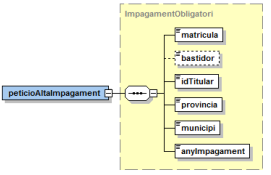
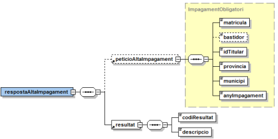
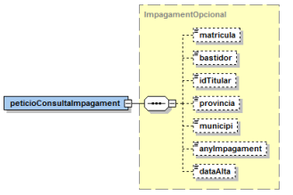
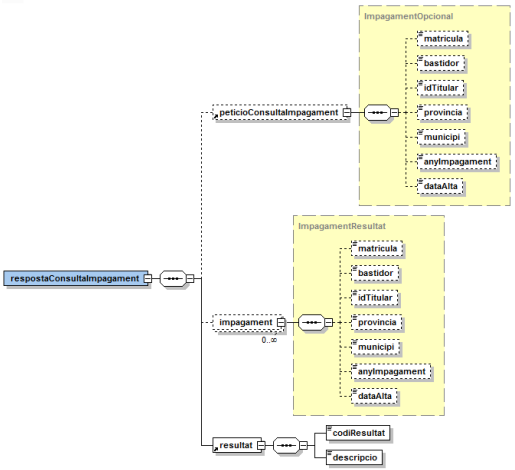
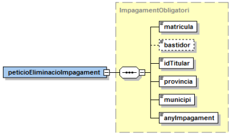
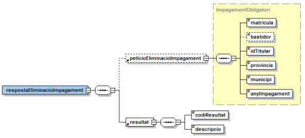
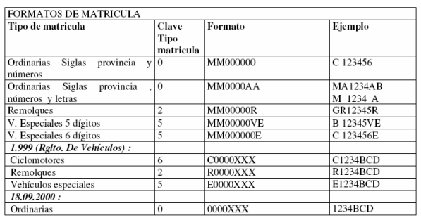

# Via Oberta – DGT-ATMV
Documentació d'integració del servei DGT-ATMV del Consorci AOC.

## Index

- 1 Introducció
- 2 Transmissions de dades disponibles
- 3 Missatgeria del servei
      - 3.1 Gestió d’impagaments
         - 3.1.1 Alta d’impagament en el registre de deutors (ATMV_ALTA)
         - 3.1.2 Consulta d’impagament en el registre de deutors (ATMV_CONSULTA)
         - 3.1.3 Eliminar impagament en el registre de deutors (ATMV_ELIMINAR)
      - 3.2 Codis de resultat
      - 3.3 Formats de matrícules
- 4 Joc de proves


## 1 Introducció

Aquest document detalla la missatgeria associada al servei de consulta del servei de Acreditación

Telémática Impuesto Municipal de Vehículos (en endavant ATMV) de la Dirección General de Tráfico (DGT).

Per poder realitzar la integració cal conèixer prèviament la següent documentació: <ul><li>Document d’Especificació de missatgeria pel consum de productes de la plataforma PCI del Consorci AOC.</li</ul>

## 2 Transmissions de dades disponibles

Les operacions disponibles a través del servei són les que es presenten a continuació:

- **EMISSOR**: DGT (Dirección General de Tráfico)

| **PRODUCTE** | **MODALITAT** | **DESCRIPCIO** |
| --- | --- | --- |
| **ATMV** | ATMV_ALTA | Gestió d’impagaments de l’impost de tracció mecànica de vehicles: alta d’impagament en el registre de deutors
| **ATMV** | ATMV_CONSULTA | Gestió d’impagaments de l’impost de tracció mecànica de vehicles: consulta d’impagament en el registre de deutors
| **ATMV** | ATMV_ELIMINAR | Gestió d’impagaments de l’impost de tracció mecànica de vehicles: eliminació d’impagament en el registre de deutors.

## 3 Missatgeria del servei

A continuació es detalla la missatgeria corresponent al bloc de dades específiques de les diferents modalitats de consum del producte.

#### 3.1 Gestió d’impagaments

DGT habilita de 08:00 a 18:00 40 peticions cada 10 segons.

##### 3.1.1 Alta d’impagament en el registre de deutors (ATMV_ALTA)

Aquesta operació permet introduir la informació dels impagaments associats a un vehícle / titular / ajuntament any en el registre de deutors de la DGT.


3.1.1.1 Petició - dades específiques

| _Element_ | _Descripció_ |
| --- | --- |
/peticioAltaImpagament/matricula | Matrícula del vehicle. Tamany màxim de 9 caracters, seguint el patró definit en l’annex.
/peticioAltaImpagament/bastidor | Número de bastidor del vehícle d’un màxim de 21 caràcters.
/peticioAltaImpagament/idTitular | Document d’identitat del titular del vehícle (NIF, CIF, NIE) en format sense separadors amb un tamany de 9 caràcters.
/peticioAltaImpagament/provincia | Codi INE de provincia de 2 posicions.
/peticioAltaImpagament/municipi | Codi INE de municipi de 5 posicions (sense dígit de control).
/peticioAltaImpagament/anyImpagament | Any en 4 digits (major del 2007). Correspon a l’exercici de l’impagament.

<p align="center">

</p>

3.1.1.2 Resposta - dades específiques

| _Element_ | _Descripció_ |
| --- | --- |
/respostaAltaImpagament/peticioAltaImpagament | Bloc de dades corresponent a la petició que origina la resposta (per més detalls vegeu l’apartat anterior).
/respostaAltaImpagament/resultat/codiResultat | Codi de resultat de la operació. Per més detalls vegeu l’apartat 3.2.
/respostaAltaImpagament/resultat/descripcio | Descripció del resultat de la operació.

<p align="center">

</p>

##### 3.1.2 Consulta d’impagament en el registre de deutors (ATMV_CONSULTA)...........

Aquesta operació permet consultar la informació dels impagaments associats a un vehícle / titular /

ajuntament any en el registre de deutors de la DGT.

3.1.2.1 Petició - dades específiques

<p align="center">

</p>

| _Element_ | _Descripció_ |
| --- | --- |
/peticioConsultaImpagament/matricula | Matrícula del vehicle. Tamany màxim de 9 caracters, seguint el patró definit en l’annex.
/peticioConsultaImpagament/bastidor | Número de bastidor del vehícle d’un màxim de 21 caràcters.
/peticioConsultaImpagament/idTitular | Document d’identitat del titular del vehícle (NIF, CIF, NIE) en format sense separadors amb untamany de 9 caràcters.
/peticioConsultaImpagament/provincia | Codi INE de provincia de 2 posicions^1.
/peticioConsultaImpagament/municipi | Codi INE de municipi de 5 posicions (sense dígit de control).
/peticioConsultaImpagament/anyImpagament | Any en 4 digits (major del 2007). Correspon a l’exercici de l’impagament.
/peticioConsultaImpagament/dataAlta | Data d’alta en el registre de deutors, format DD/MM/AAAA o %/MM/AAAA).

3.1.2.2 Resposta - dades específiques

<p align="center">

</p>

Codis de provincies i municipis INE disponibles a: [http://www.ine.es/jaxi/menu.do?type=pcaxis&path=%2Ft20%2Fe245%2Fcodmun%2F&file=inebase&L=](http://www.ine.es/jaxi/menu.do?type=pcaxis&path=%2Ft20%2Fe245%2Fcodmun%2F&file=inebase&L=)


| _Element_ | _Descripció_ |
| --- | --- |
/respostaConsultaImpagament/peticioConsultaImpagament | Bloc de dades corresponent a la petició que origina la resposta (per més detalls vegeu l’apartat anterior).
/respostaConsultaImpagament/impagament | Bloc de dades amb la llista d’impagaments.
//impagament/matricula | Matrícula del vehicle. Tamany màxim de 9 caracters, seguint el patró definit en l’annex.
//impagament/bastidor | Número de bastidor del vehícle d’un màxim de 21 caràcters.
//impagament/idTitular | Document d’identitat del titular del vehícle (NIF, CIF, NIE) en format sense separadors amb un tamany de 9 caràcters.
//impagament/provincia | Codi INE de provincia de 2 posicions.
//impagament/municipi | Codi INE de municipi de 5 posicions (sense dígit de control).
//impagament/anyImpagament | Any en 4 digits (major del 2007). Correspon a l’exercici de l’impagament.
//impagament/dataAlta | Data d’alta en el registre de deutors, format dd/MM/yyyy HH:mm:ss.
/respostaConsultaImpagament/resultat/codiResultat | Codi de resultat de la operació. Per més detalls vegeu l’apartat 3.2.
/respostaConsultaImpagament/resultat/descripcio | Descripció del resultat de la operació.

##### 3.1.3 Eliminar impagament en el registre de deutors (ATMV_ELIMINAR)

Aquesta operació permet eliminar la informació dels impagaments associats a un vehícle / titular /ajuntament any en el registre de deutors de la DGT.

3.1.3.1 Petició - dades específiques

<p align="center">

</p>

| _Element_ | _Descripció_ |
| --- | --- |
/peticioEliminacioImpagament/matricula | Matrícula del vehicle. Tamany màxim de 9 caracters, seguint el patró definit en l’annex.
/peticioEliminacioImpagament/bastidor | Número de bastidor del vehícle d’un màxim de 21 caràcters.
/peticioEliminacioImpagament/idTitular | Document d’identitat del titular del vehícle (NIF, CIF, NIE) en format sense separadors amb un tamany de 9 caràcters.
/peticioEliminacioImpagament/provincia | Codi INE de provincia de 2 posicions.
/peticioEliminacioImpagament/municipi | Codi INE de municipi de 5 posicions (sense dígit de control).
/peticioEliminacioImpagament/anyImpagament | Any en 4 digits (major del 2007). Correspon a l’exercici de l’impagament.

3.1.3.2 Resposta - dades específiques

<p align="center">

</p>

| _Element_ | _Descripció_ |
| --- | --- |
/respostaEliminacioImpagament/peticioEliminacioImpagament | Bloc de dades corresponent a la petició que origina la resposta (per més detalls vegeu l’apartat anterior).
/respostaEliminacioImpagament/resultat/codiResultat | Codi de resultat de la operació. Per més detalls vegeu l’apartat 3.2.
/respostaEliminacioImpagament/resultat/descripcio | Descripció del resultat de la operació.

#### 3.2 Codis de resultat

<ul><li>ATMV00000: operació realitzada correctament</li><li>ATMV00101: accés al servei fora de l’horari establert pel servei.</li><li>ATMV00200: error tècnic de la plataforma ATMV.</li><li>ATMV00201: certificat emprat per accedir al servei invàlid.</li><li>ATMV00202: l’identificador de l’usuari requeridor no coincideix amb el del certificat digital usat en la firma del missatge.</li><li>ATMV00300: error tècnic de la plataforma ATMV.</li><li>ATMV00301: l’usuari requeridor no està autoritzat a accedir al servei.</li><li>ATMV00400: error tècnic de la plataforma ATMV.</li><li>ATMV00401: l’entitat de l’usuari requeridor no té assignat cap municipi.</li><li>ATMV00500: matrícula incorrecta.</li><li>ATMV00501: bastidor incorrecte.</li><li>ATMV00502: identificador del titular incorrecte.</li><li>ATMV00503: any d’impagament incorrecte.</li><li>ATMV00504: l’ens requeridor no té competències sobre la provincia informada.</li><li>ATMV00505: l’ens requeridor no té competències sobre el municipi informat.</li><li>ATMV00506: data d’alta d’impagament no és correcta.</li><li>ATMV00600: error tècnic de la plataforma ATMV.</li><li>ATMV00601: el vehicle que es vol donar d’alta no té informació associada.</li><li>ATMV00602: el vehicle que es vol donar d’alta té informació associada però el bastidor indicat no coincideix amb les dades del vehicle.</li><li>ATMV00604: el vehicle està donat de baixa definitiva i la operació no es pot portar a terme.</li><li>ATMV00800: error tècnic de la plataforma ATMV.</li><li>ATMV00801: l’impagament que es vol donar d’alta ja existeix.</li><li>ATMV00802: la cerca no retorna cap resultat.</li><li>ATMV00803: la cerca no retorna més de 75 resultats i cal delimitar la cerca.</li><li>ATMV00804: l’impagament que es vol donar de baixa no existeix.</li><li>ATMV99999: error tècnic de la plataforma ATMV.</li></ul>

#### 3.3 Formats de matrícules

Les següents taules recullen els diferents formats de matrícules vàlids que suportats actualment a les bases de dades de la DGT:

c

Les lletres en negreta indiquen que són fixes, el 0 indica un dígit, L indica una lletra i S indica possibilitat de lletra o espai en blanc.

Per exemple, en cas de matrícules en format antic (SS0000LL) es pot donar el cas de distintius de
província d’una sola lletra (per exemple Madrid). En aquest cas, el format correcte és emprar la
primera posició pel distintiu (M en aquest exemple) i la segona posició deixar-la en blanc. Exemples: M
1234JT, TO1234AA.

<p align="center">

</p>

## 4 Joc de proves

El joc de proves del servei proporcionat per l’emissor final, vàlid per a l’entorn de pre-producció, és el que es detalla a continuació.

```
Província Municipi Matrícula Bastidor Titular Any impagament
Altes correctes
31 2016 NA6584AY 00557751R 2010
31 2016 NA6584AY 00557751R 2009
31 2016 2703GGG MAT4640718SL00463 44299173T 2010
```
```
31 2016 2703GGG MAT4640718SL00463 44299173T 2009
31 2016 E0009BBB CLM0292750062 04967008C 2010
31 2016 E0009BBB CLM0292750062 04967008C 2009
```
```
Vehicle donat de baixa definitiva
31 2016 0009BBB KMXKNE1CPYU380148 B01152974 2010
31 2016 0009BBB KMXKNE1CPYU380148 B01152974 2009
```
```
Matricula incorrecta
31 2016 VI00310 MAT4640718SL00463 44299173T 2010
```
```
Número de bastidor incorrecte
31 2016 2703GGG MAT4640?? 44299173T 2010
```
```
NIF incorrecte
31 2016 2703GGG MAT4640718SL00463 M1234567F 2010
```
```
Vehicle sense antecedents
31 2016 VA9999ZZ 30656485S 2010
```

## Annex – exemple de missatges

#### Alta impagament (ATMV_ALTA)

Exemple petició

<Peticion xmlns="http://gencat.net/scsp/esquemes/peticion">
<Atributos>
<IdPeticion>ATMV000</IdPeticion>
<NumElementos>1</NumElementos>
<TimeStamp/>
<CodigoCertificado>ATMV_ALTA</CodigoCertificado>
<CodigoProducto>ATMV</CodigoProducto>
<DatosAutorizacion>
<IdentificadorSolicitante>9821920002</IdentificadorSolicitante>
<NombreSolicitante>CAOC</NombreSolicitante>
<Finalidad>PROVES</Finalidad>
</DatosAutorizacion>
<Emisor>
<NifEmisor/>
<NombreEmisor>DGT</NombreEmisor>
</Emisor>
<Funcionario>
<NombreCompletoFuncionario>FUNCIONARI</NombreCompletoFuncionario>
<NifFuncionario>NIF</NifFuncionario>
<EMailFuncionario/>
</Funcionario>
</Atributos>
<Solicitudes>
<SolicitudTransmision>
<DatosGenericos>
<Emisor>
<NifEmisor/>
<NombreEmisor>DGT</NombreEmisor>
</Emisor>
<Solicitante>
<IdentificadorSolicitante>9821920002</IdentificadorSolicitante>
<NombreSolicitante>CAOC</NombreSolicitante>
<Finalidad>PROVES</Finalidad>
<Consentimiento>Si</Consentimiento>
<Funcionario>
<NombreCompletoFuncionario>FUNCIONARI</NombreCompletoFuncionario>
<NifFuncionario>NIF</NifFuncionario>
<EMailFuncionario/>
</Funcionario>
</Solicitante>
<Titular>
<TipoDocumentacion/>
<Documentacion/>
<NombreCompleto/>
<Nombre/>
<Apellido1/>
<Apellido2/>
</Titular>
<Transmision>
<CodigoCertificado>ATMV_ALTA</CodigoCertificado>
<IdSolicitud>1</IdSolicitud>
<IdTransmision>EXPEDIENT</IdTransmision>
<FechaGeneracion/>
</Transmision>
</DatosGenericos>
<DatosEspecificos>
<peticioAltaImpagament xmlns="http://www.aocat.net/dgt/atmv">
<matricula>NA6584AY</matricula>
<idTitular>99999999R</idTitular>
<provincia>31</provincia>
<municipi>31201</municipi>
<anyImpagament>2010</anyImpagament>
</peticioAltaImpagament>
</DatosEspecificos>
</SolicitudTransmision>


Exemple petició
</Solicitudes>
</Peticion>

Exemple resposta

<res:Respuesta xmlns:res="http://gencat.net/scsp/esquemes/respuesta">
<res:Atributos>
<res:CodigoCertificado>ATMV_ALTA</res:CodigoCertificado>
<res:CodigoProducto>ATMV</res:CodigoProducto>
<res:IdPeticion>ATMV000</res:IdPeticion>
<res:IdSolicitanteOriginal/>
<res:NomSolicitanteOriginal/>
<res:NumElementos>1</res:NumElementos>
<res:TimeStamp>2010- 03 - 24T12:09:58.880+01:00</res:TimeStamp>
<res:Emisor>
<res:NifEmisor/>
<res:NombreEmisor>DGT</res:NombreEmisor>
</res:Emisor>
<res:Estado>
<res:CodigoEstado>0003</res:CodigoEstado>
<res:CodigoEstadoSecundario/>
<res:LiteralError>OK</res:LiteralError>
<res:TiempoEstimadoRespuesta>0</res:TiempoEstimadoRespuesta>
</res:Estado>
<res:Funcionario>
<res:NombreCompletoFuncionario>FUNCIONARI</res:NombreCompletoFuncionario>
<res:NifFuncionario>NIF</res:NifFuncionario>
<res:EMailFuncionario/>
<res:CertificadoDigital/>
</res:Funcionario>
</res:Atributos>
<res:Transmisiones>
<res:TransmisionDatos>
<res:DatosGenericos>
<res:Emisor>
<res:NombreEmisor>DGT</res:NombreEmisor>
<res:NifEmisor/>
</res:Emisor>
<res:Solicitante>
<res:IdentificadorSolicitante>9821920002</res:IdentificadorSolicitante>
<res:NombreSolicitante>CAOC</res:NombreSolicitante>
<res:Finalidad>PROVES</res:Finalidad>
<res:Consentimiento>Si</res:Consentimiento>
<res:Funcionario>
<res:NombreCompletoFuncionario>FUNCIONARI</res:NombreCompletoFuncionario>
<res:NifFuncionario>NIF</res:NifFuncionario>
<res:EMailFuncionario/>
<res:CertificadoDigital/>
</res:Funcionario>
</res:Solicitante>
<res:Titular>
<res:TipoDocumentacion>NIF</res:TipoDocumentacion>
<res:Documentacion/>
<res:NombreCompleto/>
<res:Nombre/>
<res:Apellido1/>
<res:Apellido2/>
</res:Titular>
<res:Transmision>
<res:CodigoCertificado>ATMV_ALTA</res:CodigoCertificado>
<res:FechaGeneracion/>
<res:IdSolicitud>1</res:IdSolicitud>
<res:IdTransmision>EXPEDIENT</res:IdTransmision>
</res:Transmision>
</res:DatosGenericos>
<res:DatosEspecificos>
<ns3:respostaAltaImpagament xmlns:ns3="http://www.aocat.net/dgt/atmv">
<ns3:peticioAltaImpagament>
<ns3:matricula>NA6584AY</ns3:matricula>
<ns3:idTitular>99999999R</ns3:idTitular>
<ns3:provincia>31</ns3:provincia>


Exemple resposta
<ns3:municipi>31201</ns3:municipi>
<ns3:anyImpagament>2010</ns3:anyImpagament>
</ns3:peticioAltaImpagament>
<ns3:resultat>
<ns3:codiResultat>ATMV00000</ns3:codiResultat>
<ns3:descripcio>Operación realizada.</ns3:descripcio>
</ns3:resultat>
</ns3:respostaAltaImpagament>
</res:DatosEspecificos>
</res:TransmisionDatos>
</res:Transmisiones>
</res:Respuesta>

#### Consulta impagament (ATMV_CONSULTA)

Exemple petició

<Peticion xmlns="http://gencat.net/scsp/esquemes/peticion">
<Atributos>
<IdPeticion>ATMV_00 1 </IdPeticion>
<NumElementos>1</NumElementos>
<TimeStamp/>
<CodigoCertificado>ATMV_CONSULTA</CodigoCertificado>
<CodigoProducto>ATMV</CodigoProducto>
<DatosAutorizacion>
<IdentificadorSolicitante>9821920002</IdentificadorSolicitante>
<NombreSolicitante>CAOC</NombreSolicitante>
<Finalidad>PROVES</Finalidad>
</DatosAutorizacion>
<Emisor>
<NifEmisor/>
<NombreEmisor>DGT</NombreEmisor>
</Emisor>
<Funcionario>
<NombreCompletoFuncionario>FUNCIONARI</NombreCompletoFuncionario>
<NifFuncionario>NIF</NifFuncionario>
<EMailFuncionario/>
</Funcionario>
</Atributos>
<Solicitudes>
<SolicitudTransmision>
<DatosGenericos>
<Emisor>
<NifEmisor/>
<NombreEmisor>DGT</NombreEmisor>
</Emisor>
<Solicitante>
<IdentificadorSolicitante>9821920002</IdentificadorSolicitante>
<NombreSolicitante>CAOC</NombreSolicitante>
<Finalidad>PROVES</Finalidad>
<Consentimiento>Si</Consentimiento>
<Funcionario>
<NombreCompletoFuncionario>FUNCIONARI</NombreCompletoFuncionario>
<NifFuncionario>NIF</NifFuncionario>
<EMailFuncionario/>
</Funcionario>
</Solicitante>
<Titular>
<TipoDocumentacion/>
<Documentacion/>
<NombreCompleto/>
<Nombre/>
<Apellido1/>
<Apellido2/>
</Titular>
<Transmision>
<CodigoCertificado>ATMV_CONSULTA</CodigoCertificado>
<IdSolicitud>1</IdSolicitud>
<IdTransmision>EXPEDIENT</IdTransmision>


Exemple petició
<FechaGeneracion/>
</Transmision>
</DatosGenericos>
<DatosEspecificos>
<peticioConsultaImpagament xmlns="http://www.aocat.net/dgt/atmv">
<idTitular>99999999R</idTitular>
</peticioConsultaImpagament>
</DatosEspecificos>
</SolicitudTransmision>
</Solicitudes>
</Peticion>

Exemple resposta

<res:Respuesta xmlns:res="http://gencat.net/scsp/esquemes/respuesta">
<res:Atributos>
<res:CodigoCertificado>ATMV_CONSULTA</res:CodigoCertificado>
<res:CodigoProducto>ATMV</res:CodigoProducto>
<res:IdPeticion>ATMV_001</res:IdPeticion>
<res:IdSolicitanteOriginal/>
<res:NomSolicitanteOriginal/>
<res:NumElementos>1</res:NumElementos>
<res:TimeStamp>2010- 03 - 24T12:11:39.23+01:00</res:TimeStamp>
<res:Emisor>
<res:NifEmisor/>
<res:NombreEmisor>DGT</res:NombreEmisor>
</res:Emisor>
<res:Estado>
<res:CodigoEstado>0003</res:CodigoEstado>
<res:CodigoEstadoSecundario/>
<res:LiteralError>OK</res:LiteralError>
<res:TiempoEstimadoRespuesta>0</res:TiempoEstimadoRespuesta>
</res:Estado>
<res:Funcionario>
<res:NombreCompletoFuncionario>FUNCIONARI</res:NombreCompletoFuncionario>
<res:NifFuncionario>NIF</res:NifFuncionario>
<res:EMailFuncionario/>
<res:CertificadoDigital/>
</res:Funcionario>
</res:Atributos>
<res:Transmisiones>
<res:TransmisionDatos>
<res:DatosGenericos>
<res:Emisor>
<res:NombreEmisor>DGT</res:NombreEmisor>
<res:NifEmisor/>
</res:Emisor>
<res:Solicitante>
<res:IdentificadorSolicitante>9821920002</res:IdentificadorSolicitante>
<res:NombreSolicitante>CAOC</res:NombreSolicitante>
<res:Finalidad>PROVES</res:Finalidad>
<res:Consentimiento>Si</res:Consentimiento>
<res:Funcionario>
<res:NombreCompletoFuncionario>FUNCIONARI</res:NombreCompletoFuncionario>
<res:NifFuncionario>NIF</res:NifFuncionario>
<res:EMailFuncionario/>
<res:CertificadoDigital/>
</res:Funcionario>
</res:Solicitante>
<res:Titular>
<res:TipoDocumentacion>NIF</res:TipoDocumentacion>
<res:Documentacion/>
<res:NombreCompleto/>
<res:Nombre/>
<res:Apellido1/>
<res:Apellido2/>
</res:Titular>
<res:Transmision>
<res:CodigoCertificado>ATMV_CONSULTA</res:CodigoCertificado>
<res:FechaGeneracion/>
<res:IdSolicitud>1</res:IdSolicitud>


Exemple resposta
<res:IdTransmision>EXPEDIENT</res:IdTransmision>
</res:Transmision>
</res:DatosGenericos>
<res:DatosEspecificos>
<ns3:respostaConsultaImpagament xmlns:ns3="http://www.aocat.net/dgt/atmv">
<ns3:peticioConsultaImpagament>
<ns3:idTitular>99999999R</ns3:idTitular>
</ns3:peticioConsultaImpagament>
<ns3:impagament>
<ns3:matricula>NA6584AY</ns3:matricula>
<ns3:bastidor/>
<ns3:idTitular>99999999R</ns3:idTitular>
<ns3:provincia>31</ns3:provincia>
<ns3:municipi>31201</ns3:municipi>
<ns3:anyImpagament>2010</ns3:anyImpagament>
<ns3:dataAlta>24/03/2010 12:10:11</ns3:dataAlta>
</ns3:impagament>
<ns3:resultat>
<ns3:codiResultat>ATMV00000</ns3:codiResultat>
<ns3:descripcio>Operación realizada.</ns3:descripcio>
</ns3:resultat>
</ns3:respostaConsultaImpagament>
</res:DatosEspecificos>
</res:TransmisionDatos>
</res:Transmisiones>
</res:Respuesta>

#### Eliminar impagament (ATMV_ELIMINAR)

Exemple petició

<Peticion xmlns="http://gencat.net/scsp/esquemes/peticion">
<Atributos>
<IdPeticion>ATMV_00 2 </IdPeticion>
<NumElementos>1</NumElementos>
<TimeStamp/>
<CodigoCertificado>ATMV_ELIMINAR</CodigoCertificado>
<CodigoProducto>ATMV</CodigoProducto>
<DatosAutorizacion>
<IdentificadorSolicitante>9821920002</IdentificadorSolicitante>
<NombreSolicitante>CAOC</NombreSolicitante>
<Finalidad>PROVES</Finalidad>
</DatosAutorizacion>
<Emisor>
<NifEmisor/>
<NombreEmisor>DGT</NombreEmisor>
</Emisor>
<Funcionario>
<NombreCompletoFuncionario>FUNCIONARI</NombreCompletoFuncionario>
<NifFuncionario>NIF</NifFuncionario>
<EMailFuncionario/>
</Funcionario>
</Atributos>
<Solicitudes>
<SolicitudTransmision>
<DatosGenericos>
<Emisor>
<NifEmisor/>
<NombreEmisor>DGT</NombreEmisor>
</Emisor>
<Solicitante>
<IdentificadorSolicitante>9821920002</IdentificadorSolicitante>
<NombreSolicitante>CAOC</NombreSolicitante>
<Finalidad>PROVES</Finalidad>
<Consentimiento>Si</Consentimiento>
<Funcionario>
<NombreCompletoFuncionario>FUNCIONARI</NombreCompletoFuncionario>
<NifFuncionario>NIF</NifFuncionario>
<EMailFuncionario/>


Exemple petició
</Funcionario>
</Solicitante>
<Titular>
<TipoDocumentacion/>
<Documentacion/>
<NombreCompleto/>
<Nombre/>
<Apellido1/>
<Apellido2/>
</Titular>
<Transmision>
<CodigoCertificado>ATMV_ELIMINAR</CodigoCertificado>
<IdSolicitud>1</IdSolicitud>
<IdTransmision>EXPEDIENT</IdTransmision>
<FechaGeneracion/>
</Transmision>
</DatosGenericos>
<DatosEspecificos>
<peticioEliminacioImpagament xmlns="http://www.aocat.net/dgt/atmv">
<matricula>NA6584AY</matricula>
<idTitular>99999999R</idTitular>
<provincia>31</provincia>
<municipi> 31201 </municipi>
<anyImpagament>20 1 0</anyImpagament>
</peticioEliminacioImpagament>
</DatosEspecificos>
</SolicitudTransmision>
</Solicitudes>
</Peticion>

Exemple resposta

<res:Respuesta xmlns:res="http://gencat.net/scsp/esquemes/respuesta">
<res:Atributos>
<res:CodigoCertificado>ATMV_ELIMINAR</res:CodigoCertificado>
<res:CodigoProducto>ATMV</res:CodigoProducto>
<res:IdPeticion>ATMV_002</res:IdPeticion>
<res:IdSolicitanteOriginal/>
<res:NomSolicitanteOriginal/>
<res:NumElementos>1</res:NumElementos>
<res:TimeStamp>2010- 03 - 24T12:13:12.444+01:00</res:TimeStamp>
<res:Emisor>
<res:NifEmisor/>
<res:NombreEmisor>DGT</res:NombreEmisor>
</res:Emisor>
<res:Estado>
<res:CodigoEstado>0003</res:CodigoEstado>
<res:CodigoEstadoSecundario/>
<res:LiteralError>OK</res:LiteralError>
<res:TiempoEstimadoRespuesta>0</res:TiempoEstimadoRespuesta>
</res:Estado>
<res:Funcionario>
<res:NombreCompletoFuncionario>FUNCIONARI</res:NombreCompletoFuncionario>
<res:NifFuncionario>NIF</res:NifFuncionario>
<res:EMailFuncionario/>
<res:CertificadoDigital/>
</res:Funcionario>
</res:Atributos>
<res:Transmisiones>
<res:TransmisionDatos>
<res:DatosGenericos>
<res:Emisor>
<res:NombreEmisor>DGT</res:NombreEmisor>
<res:NifEmisor/>
</res:Emisor>
<res:Solicitante>
<res:IdentificadorSolicitante>9821920002</res:IdentificadorSolicitante>
<res:NombreSolicitante>CAOC</res:NombreSolicitante>
<res:Finalidad>PROVES</res:Finalidad>
<res:Consentimiento>Si</res:Consentimiento>
<res:Funcionario>


Exemple resposta
<res:NombreCompletoFuncionario>FUNCIONARI</res:NombreCompletoFuncionario>
<res:NifFuncionario>NIF</res:NifFuncionario>
<res:EMailFuncionario/>
<res:CertificadoDigital/>
</res:Funcionario>
</res:Solicitante>
<res:Titular>
<res:TipoDocumentacion>NIF</res:TipoDocumentacion>
<res:Documentacion/>
<res:NombreCompleto/>
<res:Nombre/>
<res:Apellido1/>
<res:Apellido2/>
</res:Titular>
<res:Transmision>
<res:CodigoCertificado>ATMV_ELIMINAR</res:CodigoCertificado>
<res:FechaGeneracion/>
<res:IdSolicitud>1</res:IdSolicitud>
<res:IdTransmision>EXPEDIENT</res:IdTransmision>
</res:Transmision>
</res:DatosGenericos>
<res:DatosEspecificos>
<ns3:respostaEliminacioImpagament xmlns:ns3="http://www.aocat.net/dgt/atmv">
<ns3:peticioEliminacioImpagament>
<ns3:matricula>NA6584AY</ns3:matricula>
<ns3:idTitular>99999999R</ns3:idTitular>
<ns3:provincia>31</ns3:provincia>
<ns3:municipi>31201</ns3:municipi>
<ns3:anyImpagament>2010</ns3:anyImpagament>
</ns3:peticioEliminacioImpagament>
<ns3:resultat>
<ns3:codiResultat>ATMV00000</ns3:codiResultat>
<ns3:descripcio>Operación realizada.</ns3:descripcio>
</ns3:resultat>
</ns3:respostaEliminacioImpagament>
</res:DatosEspecificos>
</res:TransmisionDatos>
</res:Transmisiones>
</res:Respuesta>


